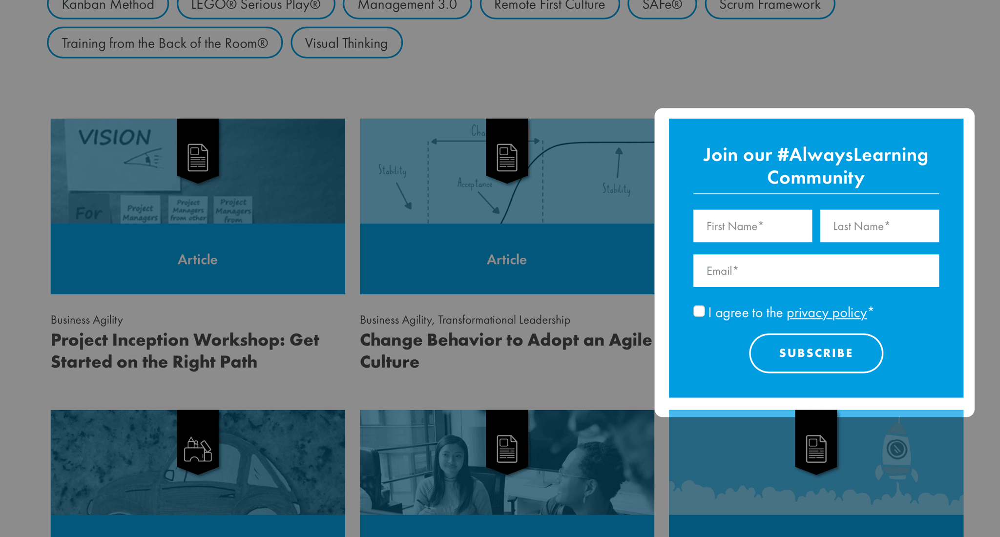
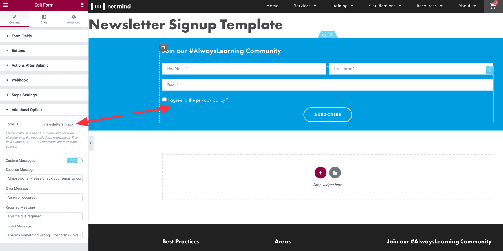

# ShuffleJS Post Filter #
**Contributors:** TheWebist  
**Tags:** comments, spam  
**Requires at least:** 4.5  
**Tested up to:** 5.7  
**Stable tag:** 1.9.7  
**License:** GPLv2 or later  
**License URI:** https://www.gnu.org/licenses/gpl-2.0.html  

Displays a listing of posts sortable by ShuffleJS using the shortcode `[postfilter]` with the following options:

```
/**
 * Displays a ShuffleJS powered listing of posts.
 *
 * @param      array  $atts {
 *    @type  string   $category            When querying `posts`, filter the posts by category. Accepts a comma separated list of category slugs.
 *    @type  string   $category_not_in     When querying `posts`, exclude the posts by category. Accepts a comma separated list of category slugs.
 *    @type  int      $default_thumbnail   Default thumbnail ID.
 *    @type  string   $exclude             List of terms to exclude from the ShuffleJS filter list.
 *    @type  string   $filter_class_name   Filter class name.
 *    @type  int      $gridId              Will be used as the HTML id attribute. Must be unique on the output page.
 *    @type  int      $limit               Set the number of initial results as well as the size of each page of results. Defaults to `30`, set to
 *                                         `-1` for "Endless Scroll".
 *    @type  int      $mobile_break_point  Minimum width in pixels for mobile adjustments. For example, we are removing the Newsletter Sign Up form
 *                                         in the Knowledge Center feed when viewing on mobile. Default 500.
 *    @type  string   $order               Either ASC or DESC.
 *    @type  string   $orderby             The column we're sorting by.
 *    @type  string   $post__in            Comma separated list of Post IDs.
 *    @type  string   $post_type           The post_type.
 *    @type  int      $posts_per_page      The number of posts to return. Default -1.
 *    @type  string   $primary_role        The slug of the `role` you want to highlight when displaying "Roles/Professional Levels"
 *                                         as a filter. For example, if you want to use "Agile Coaching" as the filter under
 *                                         "Professional Levels", you set the $primary_role to `agile-coaching`, and your
 *                                         "Professional Levels" filters will show as "Advanced", "Awareness", "Core", and
 *                                         "Supporting" for "Agile Coaching".
 *    @type  bool     $include_all         Used with `post__in`, includes all other posts after initial set listed in `post__in`.
 *    @type  bool     $show_all_filters    Set this to TRUE when using the `primary_role` attribute to also show the `primary_role` as a filter.
 *    @type  bool     $show_filters        Show the filters?
 *    @type  string   $tag                 The tag. (?)
 *    @type  string   $taxonomies_display  Comma separated list of taxonomy slugs we want to display filters for.
 *    @type  string   $taxonomy            The taxonomy we're displaying as buttons.
 *    @type  string   $terms               The terms. (?)
 * }
 *
 * @return     string  HTML for displaying our ShuffleJS filter and list of posts.
 */
```

# The Newsletter Sign Up Form



On Knowledge Center pages, I've setup `shufflejs-post-filter.js` to display the "Newsletter Signup Template". In order for that form to display properly, you must ensure the following setup inside WordPress and Elementor:

1. The form must be saved as an Elementor Template with the title "Newsletter Signup Template". The plugin uses that title to query the proper template from Elementor's template library.
2. You must add `newslettersignup` as the Form ID for the form. Find this under "Content &gt; Additional Options" when you're editing the form widget.



# Instructions for Building Translations

1. Run `grunt makepot` to generate `languages/shufflejs-post-filter.pot`.
2. Copy `languages/shufflejs-post-filter.pot` with your desired language extension (e.g. `languages/shufflejs-post-filter-es_ES.po`).
3. Update the translations in the file you copied in #2 (use [PoEdit](https://poedit.net/) if you prefer a GUI).
4. Run `grunt po2mo` to build `.mo` files in `languages/`.

Note: The first time I ran `grunt po2mo`, I got the error `Can not create sync-exec directory. To fix, I had to edit `node_modules\grunt-po2mo\tasks\po2mo.js` as follows:

- Line 11 Original: `var exec = require('sync-exec');`
- Line 11 Revised: `var exec = require('child_process').execSync;`

## Changelog ##

### 1.9.7 ###
* Removing Newsletter Sign Up form in posts feed when browser width is less than the mobile break point.
* Adding `mobile_break_point` attribute to the `[postfilter]` shortcode.

### 1.9.6 ###
* Adding "Deep Linking" for News Categories (e.g. `?news-category=netminder-interviews`).

### 1.9.5 ###
* Adding `[postfilter] $query_args` logging via `NETMIND_DEBUG` constant.

### 1.9.4 ###
* Adding Spanish translation for "Face-to-Face" (i.e. "Presencial").
* Updating NPM packages.

### 1.9.3 ###
* Adding Spanish translation for "All" (i.e. "Todos").

### 1.9.2 ###
* Removing `ucwords()` from filter headings.

### 1.9.1 ###
* Updating text domain string to match the name of the lanugage file (changed "underscores" to "dashes").
* Running `load_plugin_textdomain()` during `init` hook.

### 1.9.0 ###
* Adding Spanish translation.

### 1.8.2 ###
* Adding dynamic insertion of the Newsletter Sign Up form.
* Initial translation setup.

### 1.8.1 ###
* Restoring `$post` inside `[postfilter]` to global query `$post` object.

### 1.8.0 ###
* Adding logic for "Related Courses" query when using `[postfilter post_type=product posts_per_page=3 show_filters=false]` on a Course (i.e. WooCommerce product single) page.
* Adding `posts_per_page` attribute to `[postfilter]` to allow limiting of returned results.

### 1.7.0 ###
* You can now "page" results and show a "Load More" button at the bottom. To do so, use the `limit` attribute to set the size of the page of results.

### 1.6.0 ###
* Handling `category` attribute of `[postfilter]` shortcode. Previously we weren't doing anything will a passed category. Now we are filtering by any category slugs passed via the `category="..."` attribute.
* Adding `category_not_in` attribute to `[postfilter]`.

### 1.5.2 ###
* Adding blue border to Course card design.

### 1.5.1 ###
* Updating NPM modules
* Fixing documentation formating.

### 1.5.0 ###
* Adding `primary_role` attribute for filtering out roles when displaying the "Professional Level" filters.

### 1.4.3 ###
* Adding `taxonomies_display` option for `[postfilter]` shortcode.
* Adding `[postfilter]` documentation to the README.

### 1.4.2 ###
* Adding "Deep Link" smooth scroll.

### 1.4.1 ###
* BUGFIX: Checking for `null` variable when attempting to "Deep Link" to specific Sub Categories and Certifications.

### 1.4.0 ###
* Adding "Deep Linking" to "Sub Categories" and "Certifications".

### 1.3.3 ###
* BUGFIX: Checking for existence of array before running `implode()`.

### 1.3.2 ###
* Adding "Best Practice" taxonomy.

### 1.3.1 ###
* Updating Knowledge Center posts to allow for three lines of text for titles.

### 1.3.0 ###
* Setting initial state of filter buttons with "All" selected.
* Restoring "All" to selected state when no filters are selected.

### 1.2.7 ###
* Adjusting filter buttons styling (i.e. more "pill shaped", Netmind Blue for selected buttons).

### 1.2.6 ###
* BUGFIX: Correctly assigning file version to `postfilter.css` by using `filemtime()`.

### 1.2.5 ###
* Removing title's ellipsis from the front of the flip cards.

### 1.2.4 ###
* BUGFIX: Respecting order of `post__in` attribute for `[postfilter post__in="..." /]`.

### 1.2.3 ###
* Adding `include_all` attribute to `[postfilter/]` for including all other posts when using `post__in`.

### 1.2.2 ###
* Flip Card back styling for 2nd line ellipsis on heading, and 8th line ellipsis on the excerpt.

### 1.2.1 ###
* Styling adjustments to [postfilter /] filter buttons.

### 1.2.0 ###
* Adding `post__in` attribute to specify the complete set and order of posts displayed by `[postfilter /]`.

### 1.1.5 ###
* Initializing variable and checking for varilable in `lib/fns/shortcodes.php`.

### 1.1.4 ###
* Adding "Virtual" to label for "OpenClass" classes.

### 1.1.3 ###
* Removing borders around flip cards.
* Adding `show_filters` attribute to `[postfilter]` shortcode.

### 1.1.2 ###
* Bug Fix: Using single quotes for product dataGroup attribute.
* Refactoring post meta data.

### 1.1.1 ###
* Updating Course meta color to Netmind blue.

### 1.1.0 ###
* Adding Course meta to course products.
* Adding "New" tag to courses <= 90 days old.
* Adding "flip card" animation to course products.

### 1.0.0 ###
* Updating `exclude` attribute to only remove the filter buttons from the ShuffleJS filter rather than removing the items from the query.

### 0.1.0 ###
* Initial release.
